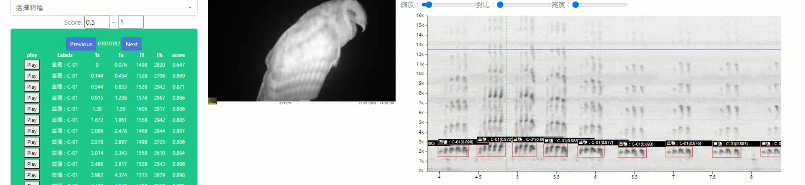

# SILIC
## Sound Identification and Labeling Intelligence for Creatures

## Goal
The goal of SILIC is to build an autonomous wildlife sound identification system which can help to monitoring the population status and trends of terrestrial vocal animals in Taiwan by using the data of Passive Acoustic Monitorings (PAMs).

## Objects
 - Object 1: Extract robust species, sound class, time and frequency information from various and complex soundscape recordings.
 - Object 2: Model can be constructed using a dataset as small as possible, and the training audios can be easily and quickly acquired.
 - Object 3: Most species of terrestrial vocal wildlife in Taiwan should be included in model, especially those are hard to be detected with survey methods other than PAM.

## Model
SILIC uses [Python](https://www.python.org/) language and [yolov5 package (Glenn Jocher et al., 2020)](https://github.com/ultralytics/yolov5) to construct an object detection model. Additional [pydub (Robert, 2011)](https://github.com/jiaaro/pydub), [nnAudio (Cheuk et al., 2020)](https://github.com/KinWaiCheuk/nnAudio) and [matplotlib (Hunter, 2007)](https://matplotlib.org/) libraries were imported for audio signal processing and Time–Frequency Representation (TFR).

## Datasets
 - Training and validation: [./dataset/Training_Validation_Dataset.txt](./dataset/Training_Validation_Dataset.txt)
 - Test with evaluation results: [./dataset/evaluation_testset.csv](./dataset/evaluation_testset.csv)

## Tutorials
 - Model Weights:
   -  [./model/exp12](./model/exp12) , including 27 sound classes of 16 species, updated on Apr. 2021
   -  [./model/exp14](./model/exp14) , including 74 sound classes of 52 species, updated on Jul. 2021
   -  [./model/exp18](./model/exp18) , including 194 sound classes of 147 species, updated on Oct. 2021
   -  [./model/exp20](./model/exp20) , including 213 sound classes of 163 species, updated on Dec. 2021
   -  [./model/exp24](./model/exp24) , including 253 sound classes of 169 species, updated on Aug. 2022
 - Scripts of detection: [./silic.ipynb](./silic.ipynb)
 - Demo video of inference results of the SILIC on detecting an camera trap video: 
 - A guide for Windows 10/11 by Ta-Chih Chen [SILIC 環境設定 for Window 10 or 11](https://medium.com/@raymond96383/silic-%E7%92%B0%E5%A2%83%E8%A8%AD%E5%AE%9A-for-window10-or-11-f5bb77d4e64f)

## Audio Sources
 - [Macaulay Library](https://www.macaulaylibrary.org/)
 - [xeno-canto](https://www.xeno-canto.org/)
 - [Asian Soundscape](https://soundscape.twgrid.org/)
 - Thinning Forest Monitoring
 - [iNaturalist](https://www.inaturalist.org/)

## Publication
- [Wu, S. H., Ko, J. C. J., Lin, R. S., Tsai, W. L., & Chang, H. W. (2023). An acoustic detection dataset of birds (Aves) in montane forests using a deep learning approach. Biodiversity Data Journal, 11, e97811. https://doi.org/10.3897/BDJ.11.e97811](https://doi.org/10.3897/BDJ.11.e97811)
- [Wu, S. H., Chang, H. W., Lin, R. S., & Tuanmu, M. N. (2022). SILIC: A cross database framework for automatically extracting robust biodiversity information from soundscape recordings based on object detection and a tiny training dataset. Ecological Informatics, 68, 101534. https://doi.org/10.1016/j.ecoinf.2021.101534](https://doi.org/10.1016/j.ecoinf.2021.101534)

## Application
- [謝宜樺（2021）兩種共域夜行性鳥類的鳴聲棲位區隔。國立東華大學自然資源與環境學系碩士論文。](http://etd.ndhu.edu.tw/cgi-bin/gs32/gsweb.cgi/ccd=iK89JD/record?r1=18&h1=0#XXXX)
- [SILIC - Telegram Bot](https://t.me/silic_redbird_bot)
- [Wu S, Tsai W, Ko J C (2022). Acoustic detections of vertebrates using SILIC in Yushan National Park, Taiwan. Taiwan Endemic Species Research Institute. Sampling event dataset https://doi.org/10.15468/bbr9k7 accessed via GBIF.org on 2022-10-10.](https://doi.org/10.15468/bbr9k7)
